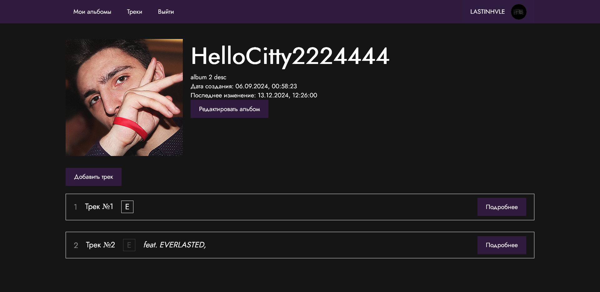

# TrackNote

**TrackNote** - это приложение для музыкантов, позволяющее вести мониторинг предстоящих / вышедших релизов.

Нередко бывает так, что музыкант хочет иметь некий "план" того, как и что он будет выпускать. Например:
- какое будет название у альбома
- какие треки в него войдут, кто будет на гостевых куплетах
- какая будет обложка
- какие песни уже готовы, а какие ещё требуют доработок
- насколько каждая конкретная песня готова
- насколько готов альбом в целом

Также нужно, чтобы вся эта информация хранилась в одном месте, была оформлена в едином стиле и легко редактировалась через web-интерфейс.

## Для чего?

Идея создания TrackNote в том, чтобы упростить музыканту организацию и планирование работ. Не в последнюю очередь идея возникла и по той причине, что автор репозитория сам занимается музыкой.

## Планы

Проект находится на ранней стадии разработки. Вот некоторые планы:

- [x] Переход на TypeScript
- [x] Регистрация и вход
- [ ] Редактирование профиля
- [ ] Добавление альбома
- [ ] Редактирование информации об альбоме, удаление альбома
- [x] Добавление треков к альбому
- [x] Удаление треков из альбома
- [x] Редактирование информации трека
- [ ] Возможность изменять степень "готовности" трека по нескольким пунктам (beat, text, record, mix)
- [ ] Возможность добавлять к трекам аудиофайлы
- [ ] Ограничение на размер загружаемых файлов, сжатие (аудиозаписи, аватары, обложки)
- [ ] "Контроль версий" песен (хранение для каждого трека истории загруженных аудиофайлов)
- [ ] Адаптация UI под разные устройства
- [ ] Публикация альбомов для общедоступного просмотра (по умолчанию альбомы видны только автору)